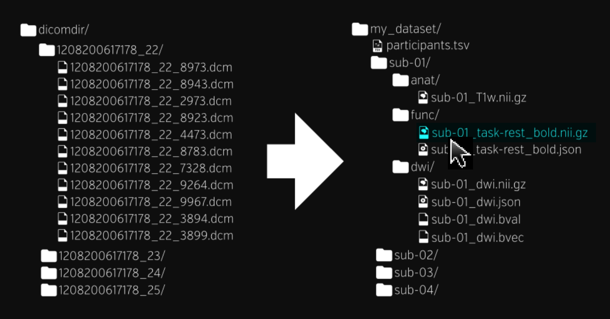

# BIDS-Curation-GUI
A Graphical User Interface to help with BIDS Curation

Getting data into the [Brain Imaging Data Structure (BIDS)](https://bids.neuroimaging.io/) format is non-trivial.  Ideally, you set scan acquisition parameters in preparation for BIDS, but mistakes will be made.  Non-ideally, you have an old set of scans you want to BIDSify.  Wouldn't it be great if you could "see" the entire situation so you can easily locate and understand the problems?  Wouldn't you like this picture to come alive to help you curate your data?



We're open to ideas on how to do this and are looking for help from anybody who wants to contribute.  The initial plan is to create a basic GUI using [React](https://reactjs.org/) and to base this project on [ReproIn](https://github.com/ReproNim/reproin#reproin), [HeuDiConv](https://github.com/nipy/heudiconv#heudiconv), and the [BIDS-Validator](https://github.com/bids-standard/bids-validator#bids-validator).  There will be instructions here on how to download an example data set to get started.

Whether or not you have skills to contribute to the coding, if you are familiar with MRI data acquisition and how it can go wrong we really want your help!  We need to know where a graphical user interface can do some good.  If you've got graphic design and technical writing skills, please help by working on a project logo, creating artwork for the GUI, and adding documentation.

This project is part of [OHBM Brainhack 2020](https://ohbm.github.io/hackathon2020/)


Build Docker images with Python and JavaScript dev/test requirements installed.

```bash
make jsdev-image
make pydev-image
```

Set the Parcel builder to watch for JavaScript code changes and compile a dev
`index.js`. Run a Flask server that loads the `index.js` and autoreloads on
Python changes.

```
# In two separate terminals ...
make parcel
make flask
```

Or, run using `./run.py inputdir outputdir` which will do both of those `make` commands and pass in an input and output directory as environment variabels.  Use `./stop.py` to shut down the docker containers.

Run pytest unit tests. Watch JavaScript files and run Jest tests.

```bash
make pytest
make jstest-watch
```

Build a local production image with Gunicorn and minified JS. Scale three
instances of the web app using Docker Compose.

```bash
make stack
make unstack
```

Deploy to a Docker service provider (e.g., ZEIT).

```bash
now --docker --public
now ls
now scale <url> 0 3
```

Flask-react generated from https://github.com/parente/cookiecutter-flask-react template
