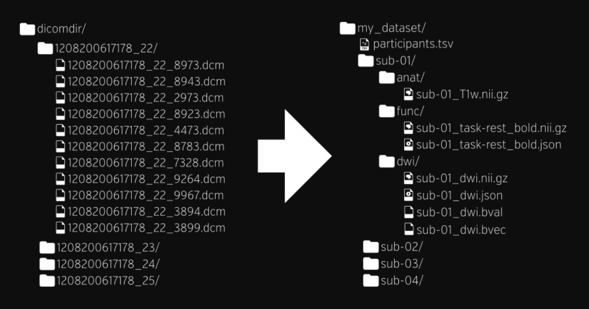

# BIDS-Curation-GUI
A Graphical User Interface to help with BIDS Curation

Getting data into the Brain Imaging Data Structure (BIDS) format is non-trivial.  Ideally, you set scan acquisition parameters in preparation for BIDS, but mistakes will be made.  Non-ideally, you have an old set of scans you want to BIDSify.  Wouldn't it be great if you could "see" the entire situation so you can easily locate and understand the problems?  Wouldn't you like this picture to come alive to help you curate your data?

